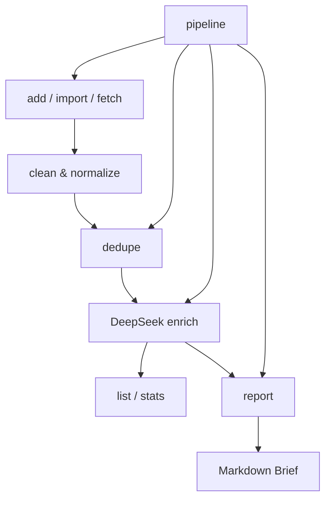
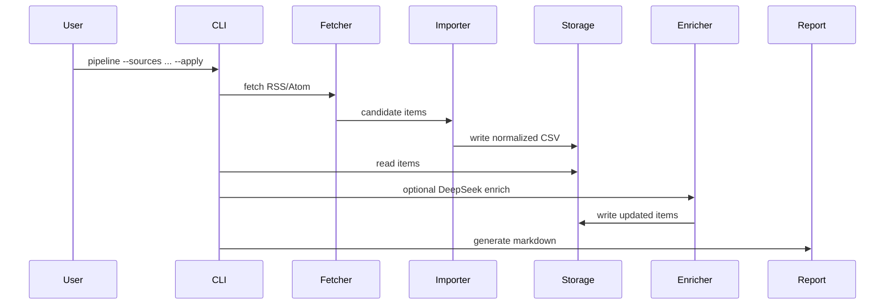

# AI Space Industry Radar

一个面向 AI 与商业航天行业调研的 AI Native CLI 工具，支持 RSS 采集、批量导入、DeepSeek 结构化增强、数据去重、统计分析和 Markdown 行业简报生成。

## 项目背景

AI 与商业航天都是高频变化行业：公司动态、研究进展、发射服务、卫星网络、政策和资本信号分散在 RSS、新闻站点、公司博客和研究源中。传统手工整理容易重复、遗漏，也难以稳定沉淀成可查询的数据集。

本项目尝试用工程化方式构建一个轻量行业情报工作流：先把信息采集到 CSV 数据集中，再通过确定性清洗、去重、筛选、统计和 LLM 结构化增强，最终输出可阅读的 Markdown 行业简报。

## 核心功能

| 功能 | 命令 | 说明 |
|---|---|---|
| 手动录入 | `add` | 交互式录入行业事件 |
| 批量导入 | `import` | 从 JSON / CSV 导入记录 |
| RSS 采集 | `fetch` | 从 RSS / Atom 获取行业信息 |
| LLM 增强 | `enrich` | 使用 DeepSeek 生成 `summary` / `signal` / `tags` / `importance` |
| 查询 | `list` | 按行业、标签、公司、时间筛选 |
| 统计 | `stats` | 查看数据集分布 |
| 去重 | `dedupe` | 基于 URL 和业务事件的确定性去重 |
| 报告 | `report` | 生成 Markdown 行业简报 |
| 工作流 | `pipeline` | 一键执行 `fetch` / `dedupe` / `enrich` / `report` |

## 架构



更多架构说明见 [docs/architecture.md](docs/architecture.md)。

Pipeline 数据流：



## 数据模型

数据存储使用 CSV，默认路径为 `data/industry_items.csv`。

```text
id,date,industry,category,company,title,source,source_url,summary,signal,tags,importance,created_at,updated_at
```

字段说明：

- `industry`：当前支持 `AI` 和 `Commercial Space`，支持中英文别名标准化。
- `source`：来源名称，例如 OpenAI Blog、NASA、SpaceX。
- `source_url`：来源链接，可为空。
- `tags`：英文分号分隔，例如 `Agent;Product;Enterprise AI`。
- `importance`：1 到 5 的整数。
- `created_at` / `updated_at`：ISO 时间字符串。

旧版本 CSV 会自动兼容。读取旧表头时，缺失字段会填充为空字符串；写入新记录时会迁移到完整字段顺序。

v1.2 引入 Storage Interface，当前默认实现为 `CsvStorage`，并通过 `storage.py`
保留旧函数兼容层。CLI 用户行为和 CSV 文件格式保持不变，后续可以在同一接口下扩展
`SQLiteStorage`。

## 安装

本项目优先使用 Python 标准库，无第三方运行依赖。建议使用 Python 3.10+。

```bash
git clone <your-repo-url>
cd ai-space-industry-radar
python -m venv .venv
source .venv/bin/activate
pip install -r requirements.txt
```

`requirements.txt` 目前不包含第三方依赖，保留它是为了项目结构清晰。

## 快速开始

手动录入一条行业事件：

```bash
python -m industry_radar add
```

查看最近记录：

```bash
python -m industry_radar list
```

按条件查询：

```bash
python -m industry_radar list --industry AI
python -m industry_radar list --industry "Commercial Space"
python -m industry_radar list --tag Agent
python -m industry_radar list --company openai
python -m industry_radar list --since 2026-06-01 --until 2026-06-07
```

生成行业简报：

```bash
python -m industry_radar report --top 10 --output outputs/weekly_report.md
```

查看示例报告：[examples/sample_report.md](examples/sample_report.md)

完整命令说明见 [docs/usage.md](docs/usage.md)。

## 批量导入

支持 JSON 和 CSV：

```bash
python -m industry_radar import --file data/import_items.json
python -m industry_radar import --file data/import_items.csv
```

JSON 文件应为对象列表。CSV 会按表头读取，字段顺序不固定。`id`、`created_at`、`updated_at` 可以缺省，缺省时自动生成。

导入时会复用去重逻辑：

- `source_url` 相同视为重复。
- 没有 `source_url` 时，使用 `date + industry + company + title` 判断重复。

## RSS / Atom 采集

复制示例 sources 配置：

```bash
cp data/sources.example.json data/sources.json
```

执行 dry-run：

```bash
python -m industry_radar fetch --sources data/sources.json --dry-run --limit 5
```

写入 CSV：

```bash
python -m industry_radar fetch --sources data/sources.json --limit 5
```

说明：

- `data/sources.example.json` 只提供示例源。
- `data/sources.json` 是本地源配置，已被 `.gitignore` 忽略。
- v1.3 引入 Source Adapter 架构，`sources.json` 支持 `type` 字段。
- v1.4 新增 `ArxivSourceAdapter`，支持通过 arXiv API 查询论文元数据。
- 当前实现 `RSSSourceAdapter` 和 `ArxivSourceAdapter`；没有 `type` 时默认按 `rss` 处理。
- `type=arxiv` 支持 `query` 或 `arxiv_category`，例如 `cat:cs.AI AND all:agent`。
- 后续可扩展 `WebPageSourceAdapter`、`LocalFileSourceAdapter` 等数据源。
- 单个 RSS 源失败不会中断其他源。
- 当前版本只解析 RSS / Atom 和 arXiv API 元数据，不抓取网页正文，不下载 PDF。
- RSS / Atom summary 会做基础文本清洗，包括去 HTML 标签、处理 HTML 实体和压缩空白。

arXiv source 示例：

```json
{
  "type": "arxiv",
  "name": "arXiv AI Agent Research",
  "query": "cat:cs.AI AND all:agent",
  "industry": "AI",
  "category": "Research",
  "default_tags": "AI;Research;arXiv;Agent",
  "sort_by": "submittedDate",
  "sort_order": "descending"
}
```

也可以使用分类简写：`"arxiv_category": "cs.AI"`。

## DeepSeek 结构化增强

配置 API Key：

```bash
export DEEPSEEK_API_KEY="your_api_key"
```

示例命令：

```bash
python -m industry_radar enrich --limit 3 --dry-run
python -m industry_radar enrich --industry AI --limit 5 --dry-run
python -m industry_radar enrich --industry AI --limit 5 --apply
python -m industry_radar enrich --industry space --overwrite --apply
python -m industry_radar enrich --industry AI --model deepseek-v4-pro --dry-run
```

默认模型是 `deepseek-v4-pro`。也可以通过 `DEEPSEEK_MODEL`、`DEEPSEEK_BASE_URL` 或 `--model` 覆盖。

安全说明：

- API Key 不要提交到 Git。
- `.env` 已被 `.gitignore` 忽略。
- 建议首次运行先 `--dry-run`。
- 只有 `--apply` 才写回 CSV。
- `--overwrite` 会覆盖已有字段，慎用。
- 测试不会真实调用 DeepSeek API。

## 数据治理

查看数据集统计：

```bash
python -m industry_radar stats
```

输出包括总记录数、行业分布、category 分布、tag 分布、company 分布、日期范围和 importance 分布。

预览重复记录：

```bash
python -m industry_radar dedupe --dry-run
```

合并并写回：

```bash
python -m industry_radar dedupe --apply
```

去重规则是确定性的，不做模糊相似度、不做向量匹配、不使用 LLM 判断：

- `source_url` 相同：忽略首尾空白和大小写。
- 业务事件相同：`date + industry + company + title` 相同，忽略首尾空白和大小写，标题会压缩连续空白。

合并规则：

- 优先保留字段更完整的记录作为主记录。
- `summary`、`signal`、`source` 在主记录为空时从其他重复记录补齐。
- `tags` 合并并去重，例如 `Agent;AI` 和 `AI;Product` 合并为 `Agent;AI;Product`。
- `importance` 使用重复组中的最高值。
- `updated_at` 更新为当前时间。
- 不修改主记录的 `id`、`date`、`industry`、`category`、`company`、`title`、`source_url`、`created_at`。

## Pipeline 工作流

日常推荐流程：

```bash
python -m industry_radar pipeline --sources data/sources.json --limit 5 --top 10 --report outputs/weekly.md --apply
```

也可以使用 JSON 配置文件驱动：

```bash
python -m industry_radar pipeline --config configs/example_pipeline.json
python -m industry_radar pipeline --config configs/example_pipeline.json --apply
python -m industry_radar pipeline \
  --config configs/example_ai_pipeline.json \
  --limit 10 \
  --industry space \
  --apply
```

默认 pipeline 是 dry-run，不写 CSV，也不生成报告文件。只有传入 `--apply` 才会执行写操作。

常用参数：

- `--sources`：RSS sources 配置文件路径；不传则跳过 fetch。
- `--limit`：每个 source 抓取条数，默认 5。
- `--industry`：传给 fetch、enrich 和 report 的行业筛选。
- `--since` / `--until`：传给 enrich 和 report 的日期筛选。
- `--report`：报告输出路径，默认 `outputs/pipeline_report.md`。
- `--top`：报告输出前 N 条。
- `--enrich`：执行 DeepSeek 增强，可能产生 API 成本。
- `--overwrite`：传给 enrich，允许覆盖已有字段。
- `--dry-run`：预览流程，不写 CSV 或报告。
- `--apply`：允许写 CSV 和报告。

配置文件只控制 pipeline 参数，不控制写入权限。`--apply` 必须在命令行显式传入。
CLI 参数优先级高于 config，合并顺序是 `defaults < config < CLI`。配置文件不应该包含
API Key，也不能包含 `apply` 字段。

## 报告结构

`report` 会生成 Markdown 行业简报，包含：

- 概览
- 行业分布
- 标签分布
- 重点条目

条目排序规则：

1. `importance` 降序
2. `date` 降序
3. `created_at` 降序

示例：

```bash
python -m industry_radar report --industry AI --top 5 --output outputs/ai_report.md
```

## 测试

运行全部测试：

```bash
python3 -B -m unittest discover -s tests
```

测试覆盖：

- 输入清洗与字段标准化
- CSV 读写与旧数据兼容
- JSON / CSV import
- RSS / Atom 解析
- DeepSeek client 和 enrich 解析逻辑
- 去重与统计
- report 生成
- pipeline 编排

测试不会真实请求网络，也不会真实调用 DeepSeek API。

## 项目边界

当前版本刻意保持轻量：

- 不使用数据库，数据存储为 CSV。
- 不做网页正文抓取。
- 不做 RAG。
- 不做向量相似度。
- 不做 Web 前端。
- 不做后台任务或定时任务。
- 不引入第三方依赖。

## 适合展示的工程点

- 用标准库实现端到端 CLI 工作流。
- 用明确模块边界拆分采集、导入、清洗、去重、增强、报告。
- 对外部源和 LLM 调用做 dry-run 与 apply 分离，降低误操作风险。
- 对旧 CSV 表头做兼容迁移。
- 用单元测试覆盖网络、LLM、去重和 pipeline 的关键路径。

## 技术亮点

- 使用 Python 标准库构建模块化 CLI 工具。
- 设计统一 `IndustryItem` 数据模型，支撑录入、导入、采集、增强、查询和报告生成。
- 引入 Storage Interface，当前以 `CsvStorage` 承载 CSV，预留未来 `SQLiteStorage` 扩展点。
- 引入 Source Adapter 架构，当前以 `RSSSourceAdapter` 支持 RSS / Atom，以 `ArxivSourceAdapter` 支持 arXiv API，预留更多数据源扩展点。
- 实现 RSS / Atom、JSON、CSV 多入口数据流。
- 实现事件级去重与字段合并，支持 URL 去重和业务事件去重。
- 接入 DeepSeek OpenAI-compatible API 做结构化增强，生成 `summary`、`signal`、`tags`、`importance`。
- 生成包含概览、行业分布、标签分布和重点条目的可读 Markdown 行业简报。
- 使用 `unittest` 覆盖核心逻辑，测试中 mock 网络和 LLM 调用。
- 支持 dry-run / apply 安全执行模式，降低误写 CSV 和误调用 API 的风险。

## Roadmap

- SQLite 存储。
- Web UI / Streamlit。
- RAG 行业知识库。
- 定时任务。
- 更多行业源。

详细版本规划见 [docs/roadmap.md](docs/roadmap.md)。
