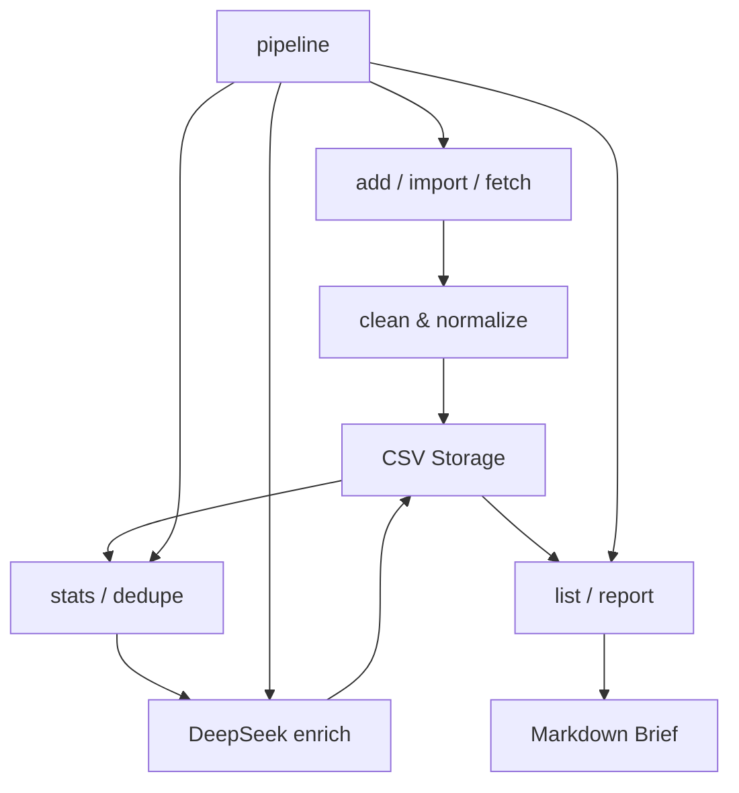
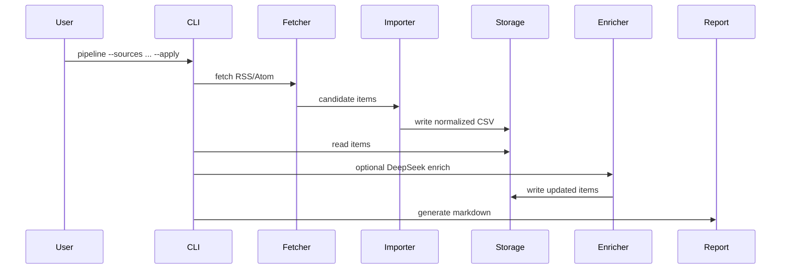
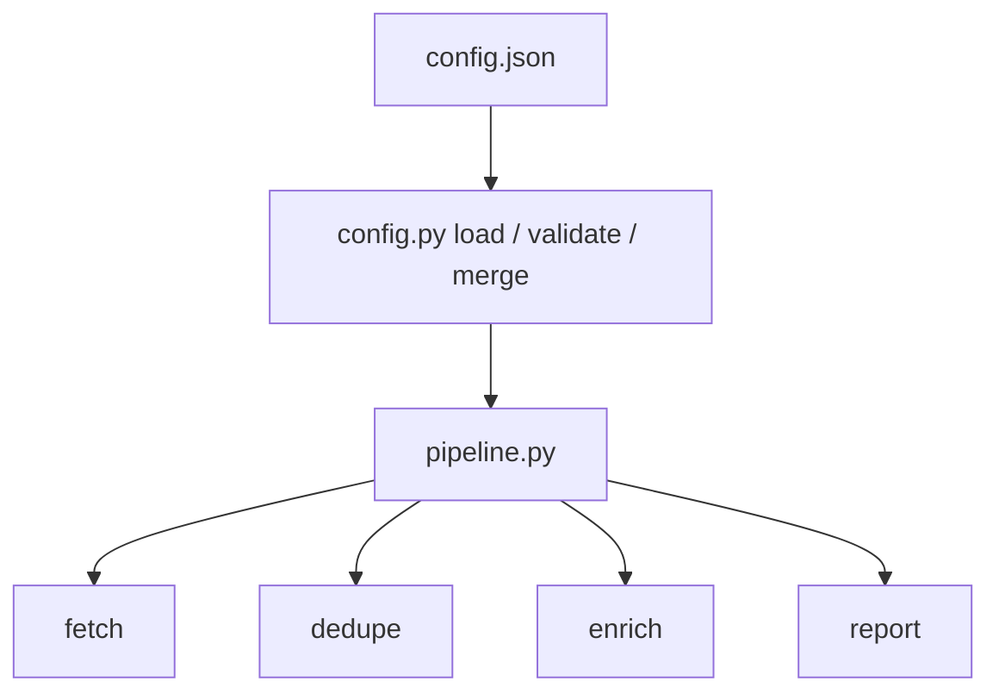

# Architecture

AI Space Industry Radar 是一个标准库优先的 CLI 项目，围绕统一的 `IndustryItem`
数据模型构建行业信息采集、清洗、导入、增强、治理和报告生成流程。

## 整体架构

## 模块职责

| 模块 | 职责 |
|---|---|
| `cli.py` | 命令行入口，解析参数并调用各功能模块 |
| `models.py` | 数据模型、输入清洗、行业标准化、日期与重要性校验 |
| `storage.py` | CSV 读写、旧表头兼容迁移、整体写回 |
| `importer.py` | JSON / CSV 批量导入、导入记录标准化、导入去重 |
| `fetcher.py` | RSS / Atom 采集、XML 清洗解析、feed item 转换 |
| `enricher.py` | LLM prompt 构造、增强结果解析、字段合并 |
| `llm_client.py` | DeepSeek OpenAI-compatible API 调用 |
| `data_governance.py` | `stats` 统计、事件级 `dedupe`、重复组合并 |
| `report.py` | Markdown 行业简报生成、排序、分布统计 |
| `pipeline.py` | 工作流编排，串联 fetch / dedupe / enrich / report |

## 数据流

## 配置驱动流程

## 设计原则

- 标准库优先，降低运行和部署门槛。
- CSV 优先，便于审计、迁移和人工检查。
- dry-run / apply 分离，降低误写入和 API 成本风险。
- 外部网络和 LLM 调用集中封装，测试中通过 mock 隔离。
- 采集、导入、治理、增强和报告模块边界清晰，便于后续替换存储或接入 Web UI。

## 关键原则

- 标准库优先。
- dry-run 优先。
- 数据入口统一。
- LLM 与业务逻辑解耦。
- 可测试性优先。
