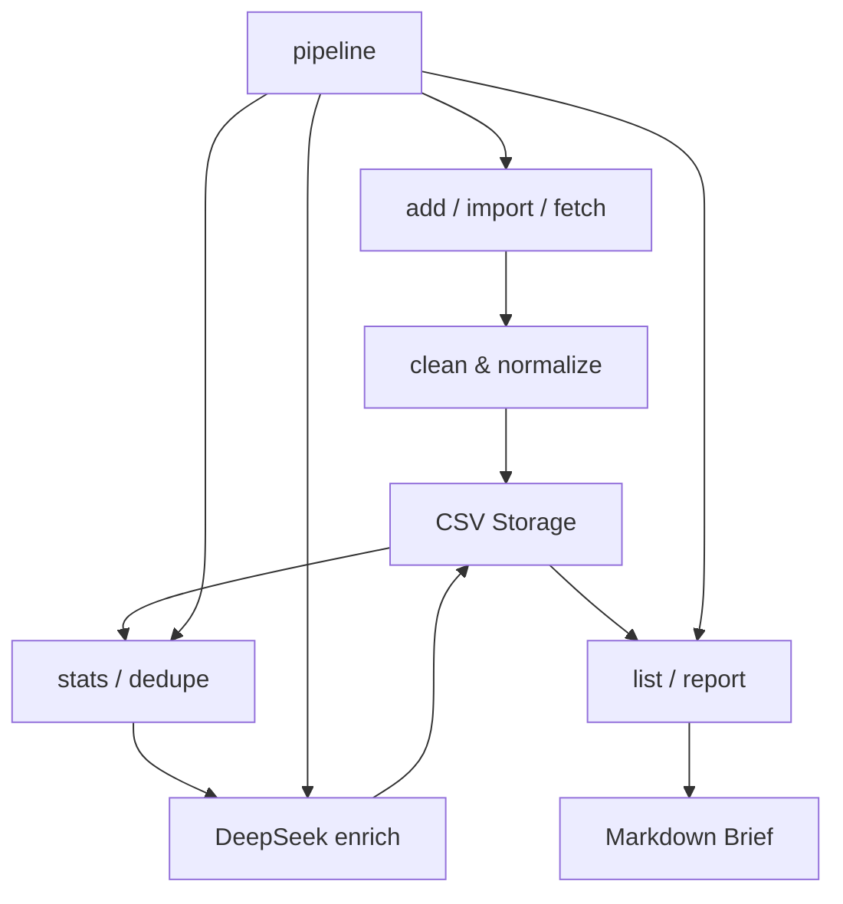
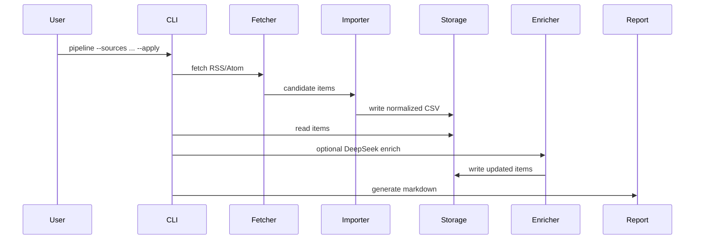
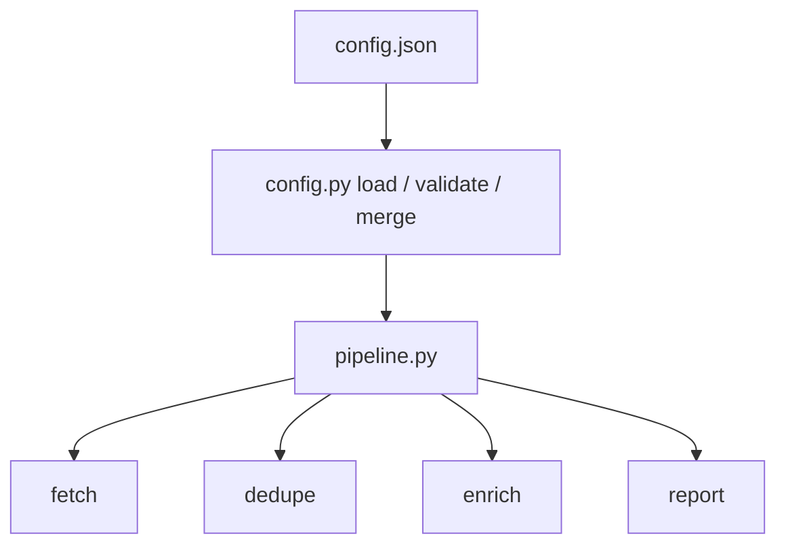
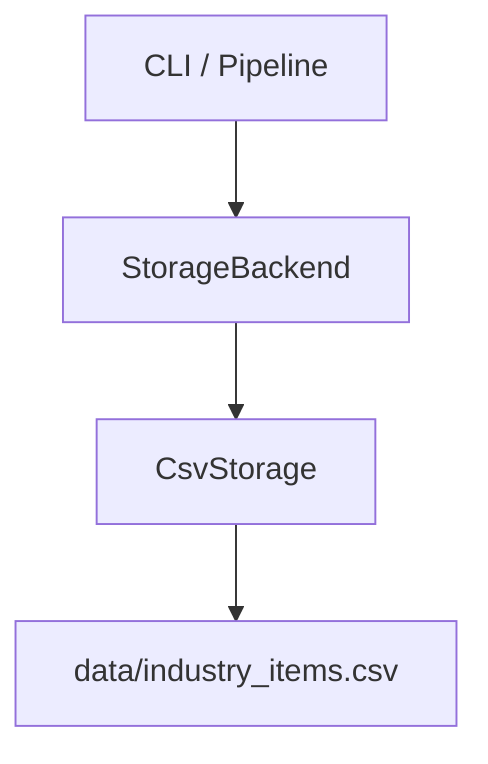
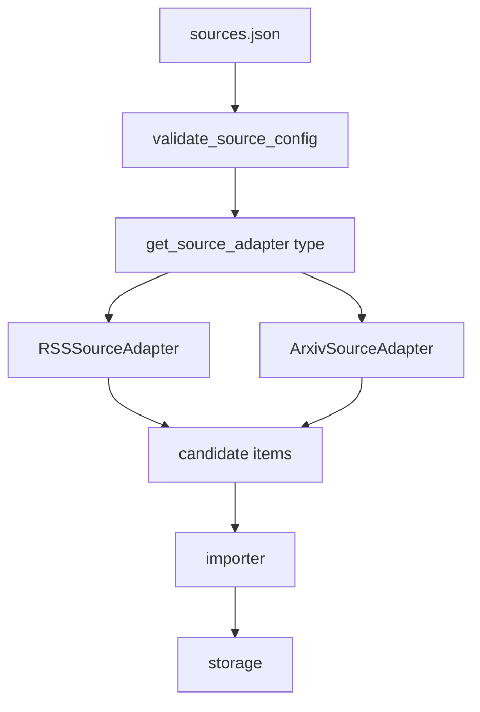
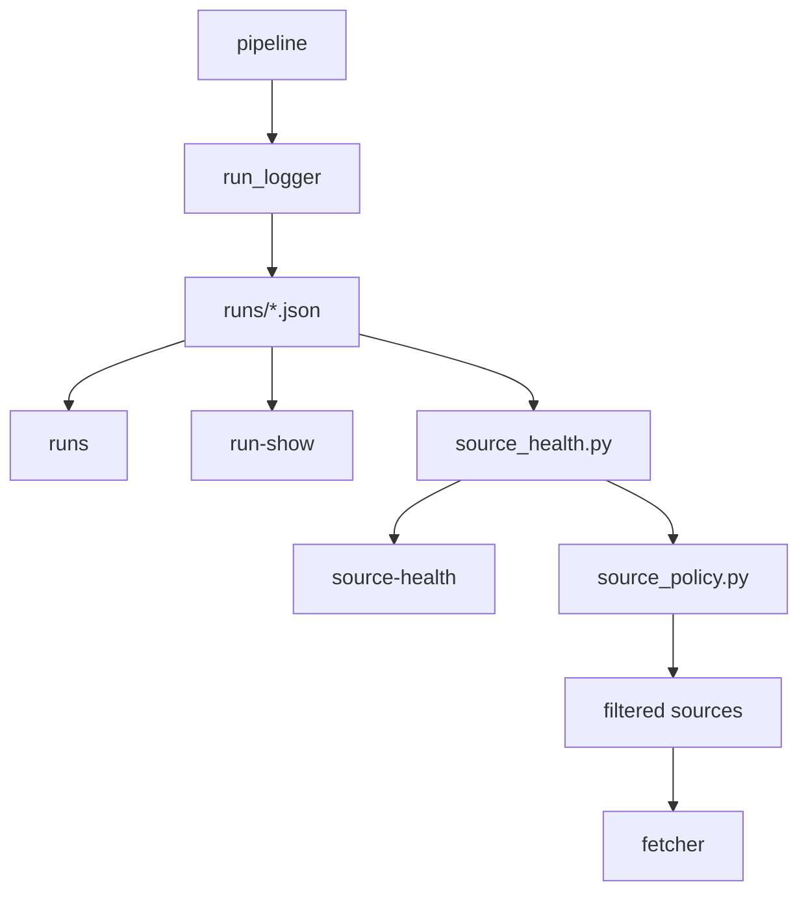
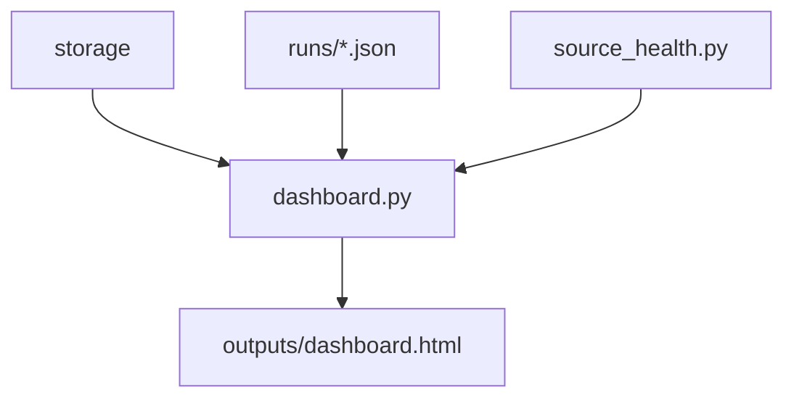
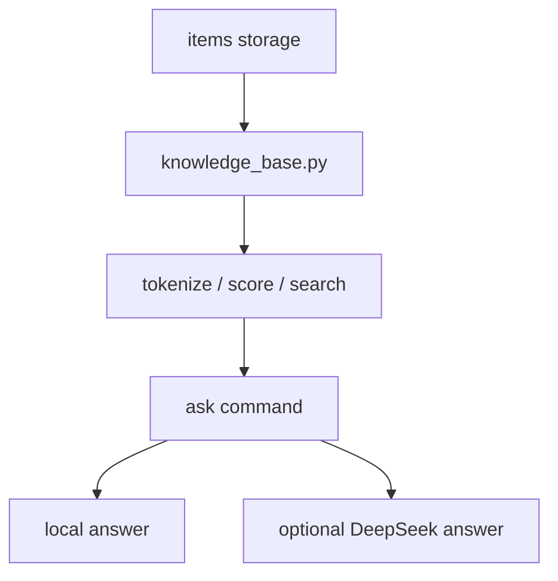
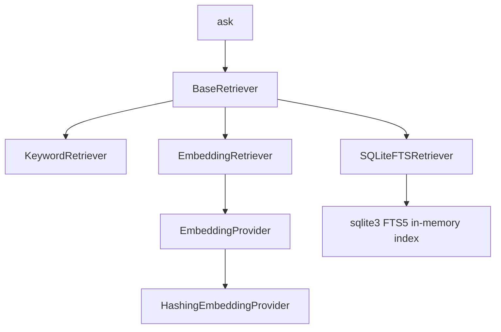

# Architecture

AI Space Industry Radar 是一个标准库优先的 CLI 项目，围绕统一的 `IndustryItem`
数据模型构建行业信息采集、清洗、导入、增强、治理和报告生成流程。

## 整体架构



## 模块职责

| 模块 | 职责 |
|---|---|
| `cli.py` | 命令行入口，解析参数并调用各功能模块 |
| `models.py` | 数据模型、输入清洗、行业标准化、日期与重要性校验 |
| `storage_backend.py` | `StorageBackend` 抽象、`CsvStorage` 实现、存储后端工厂 |
| `storage.py` | 兼容层函数，委托给 `CsvStorage` 并保留旧调用方式 |
| `importer.py` | JSON / CSV 批量导入、导入记录标准化、导入去重 |
| `source_adapters.py` | 数据源适配器接口、RSS / Atom 实现和 arXiv API 实现 |
| `fetcher.py` | 数据源编排，读取 sources 配置并调用具体 Source Adapter |
| `enricher.py` | LLM prompt 构造、增强结果解析、字段合并 |
| `llm_client.py` | DeepSeek OpenAI-compatible API 调用 |
| `data_governance.py` | `stats` 统计、事件级 `dedupe`、重复组合并 |
| `report.py` | Markdown 行业简报生成、排序、分布统计 |
| `pipeline.py` | 工作流编排，串联 fetch / dedupe / enrich / report |

## 数据流



## 配置驱动流程



## 存储层抽象



v1.2 开始，上层业务可以依赖 `StorageBackend` 的 `read_items`、`write_items`
和 `append_items` 能力，而不直接绑定 CSV 细节。当前默认后端仍然是 `CsvStorage`，
CSV 表头、兼容迁移和命令行为保持不变。

`storage.py` 继续保留 `read_items`、`write_items`、`append_item`、`append_items`
等旧函数，内部委托给 `CsvStorage`。这样可以避免一次性重构所有业务模块，同时为未来
扩展 `SQLiteStorage` 留出接口。

## 数据源插件化



```text
SourceAdapter
├── RSSSourceAdapter
├── ArxivSourceAdapter
└── LocalFileSourceAdapter
```

v1.3 开始，`fetcher.py` 不再直接绑定 RSS 细节，而是作为数据源编排层：
读取 sources 配置、校验 source、选择 adapter、汇总 candidate items，并交给 importer
做标准化、去重和写入。Adapter 不直接写 CSV，也不直接做 dedupe。

`RSSSourceAdapter` 面向 RSS / Atom feed。`ArxivSourceAdapter` 面向 arXiv API，
支持 `query` 和 `arxiv_category` 两种配置方式。`LocalFileSourceAdapter` 面向本地
Markdown / TXT，`single` 模式把整个文件作为一条行业 item，`sections` 模式按 Markdown
heading 拆分为多条 item。所有 adapter 统一输出 candidate item dict，下游 importer /
dedupe / enrich / report 不需要变化。

旧 sources 配置没有 `type` 字段时默认使用 `rss`，因此仍可运行。

## 可观测性



v1.5 开始，pipeline 不仅执行工作流，也可以在显式传入 `--save-run-log` 时记录每步指标。
run log 覆盖 `fetch`、`dedupe`、`enrich`、`report` 的 metrics 和 errors，用于定位 source
失败、LLM 失败、去重效果和报告生成结果。

v1.6 开始，`source_health.py` 从 run logs 聚合 source 失败率、最近错误和最近状态。
`source-health` 不请求网络，也不修改业务数据；它只读取 `runs/*.json` 和可选的
`sources.json`，后续可以扩展成 Dashboard 或定时监控。

v1.7 开始，`source_policy.py` 可以把健康分析结果转成决策：当 source 历史运行次数足够、
且失败率达到阈值时，pipeline 可以在本次 fetch 中跳过该 source。`source-health` 负责观察，
`source-policy` 负责决策，`fetcher` 只执行过滤后的 sources，`sources.json` 不会被修改。

运行日志是观测产物，不改变业务 CSV 数据。`runs/*.json` 默认不提交 Git，可以作为后续
Web UI、Dashboard 或定时任务的基础数据。

## 静态 Dashboard



v1.8 开始，`dashboard.py` 提供只读 HTML 输出层，聚合 CSV 数据集统计、最近事件、
最近 runs 和 source health。Dashboard 不修改 CSV，不调用 LLM，也不请求网络；生成的
`outputs/*.html` 默认不提交 Git。

## 本地知识库



v2.0 开始，`knowledge_base.py` 基于本地行业事件构建轻量 document，并使用关键词检索、
字段加权和日期 / 行业 / 标签筛选支持 `ask` 命令。当前是 lexical retrieval，不是 vector RAG；
默认不调用 LLM，只有传入 `--llm` 时才使用 DeepSeek 做综合回答。后续可以替换为
embedding retriever。

## Retriever 抽象



v2.1 开始，`ask` 通过 retriever 抽象执行检索。`KeywordRetriever` 复用原有 lexical
retrieval；`EmbeddingRetriever` 当前使用本地 `HashingEmbeddingProvider`，不依赖外部
embedding API 或向量数据库。retriever 不负责 storage，也不负责 LLM。后续可以扩展
`OpenAIEmbeddingProvider`、`DeepSeekEmbeddingProvider` 或 `LocalModelEmbeddingProvider`。

v2.2 开始，`SQLiteFTSRetriever` 使用 Python 标准库 `sqlite3` 的 FTS5 能力做本地全文检索。
它每次 `ask` 时临时构建内存索引，只负责检索，不读取 storage，不修改 CSV，也不调用 LLM。
如果本地 Python sqlite3 不支持 FTS5，CLI 会给出清晰错误；后续可以演进为持久化 SQLite index。

## 设计原则

- 标准库优先，降低运行和部署门槛。
- CSV 优先，便于审计、迁移和人工检查。
- dry-run / apply 分离，降低误写入和 API 成本风险。
- 外部网络和 LLM 调用集中封装，测试中通过 mock 隔离。
- 采集、导入、治理、增强和报告模块边界清晰，便于后续替换存储或接入 Web UI。

## 关键原则

- 标准库优先。
- dry-run 优先。
- 数据入口统一。
- LLM 与业务逻辑解耦。
- 可测试性优先。
